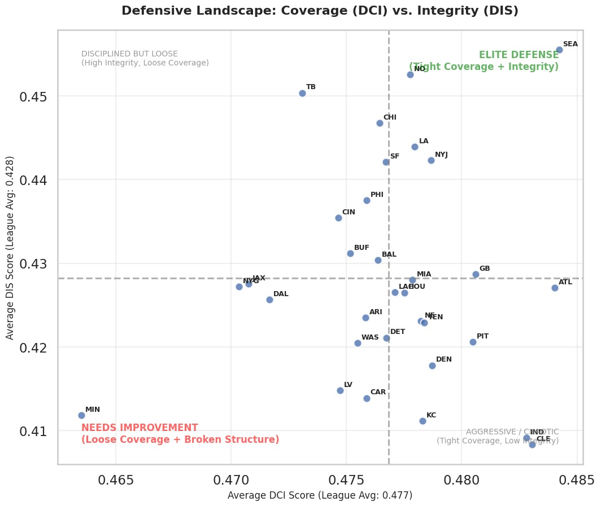

# The Geometry of Intent: Decoupling Defensive Process from Outcome via Self-Supervised Learning
### Introducing DCI and DIS: A Structural Framework for Measuring Coverage Tightness and Integrity While the Ball is in the Air.

## Introduction
The most critical moment in a passing play occurs between the quarterback's release and the ball's arrival. In these brief seconds **while the ball is in the air**, the defense faces its ultimate truth: deception ends, and pure structural execution begins. Coaches preach "finding the ball" and "maintaining leverage," yet traditional analytics largely ignore this phase, focusing instead on the result (catch, drop, or interception) rather than the process that produced it.

This disconnect creates an **outcome bias**. A defensive back might maintain perfect positioning during the pass flight, only to be "beaten" by a spectacular catch; conversely, a blown coverage might be bailed out by an inaccurate throw. Current metrics struggle to capture the geometric reality of player movement during this flight phase, conflating offensive luck with defensive quality.

This project answers the Big Data Bowl’s call to analyze movement with the ball in the air by introducing a paradigm shift: evaluating defense as a dynamic geometric structure. Leveraging **Self-Supervised Learning (SSL)**, we trained a Relational Graph Convolutional Network (R-GCN) to "watch" the secondary. By analyzing player coordinates specifically during the pass flight window, our model learned to quantify two novel dimensions of defensive movement:

* **Defensive Coverage Index (DCI):** A measure of **Spatial Tightness**. As the ball travels, how aggressively is the defense constricting the target's space relative to an ideal archetype?
* **Defensive Integrity Score (DIS):** A measure of **Structural Stability**. While tracking the ball, does the unit maintain its shape and leverage, or does the formation collapse into chaos?

By isolating the **ball-in-air phase**, we reveal the hidden physics of the secondary. From the disciplined flight adjustments of the Seattle Seahawks to the high-variance risks of aggressive schemes, our framework provides the first scalable method to quantify the geometry of defensive intent exactly when it matters most.

## The Metrics

### Defensive Coverage Index (DCI)
**Conceptual Definition:** DCI quantifies **spatial tightness** by measuring the exponential decay of the distance between a play's embedding ($z$) and the nearest ideal coverage archetype centroid ($\mu_{tight}$).

$$DCI = \exp(-\lambda \cdot ||z - \mu_{tight}||^2)$$

**Football Interpretation:** High DCI indicates aggressive spatial constriction (tight windows), forcing difficult throws but increasing susceptibility to explosive plays if leverage is lost. Conversely, Low DCI reflects "soft" coverage that concedes intermediate gains to prevent deep strikes. This metric isolates **geometric intent** from the outcome.

### Defensive Integrity Score (DIS)
**Conceptual Definition:** While DCI measures closeness, DIS quantifies **structural reliability**. It is a composite score of **Spacing Cohesion** (collective geometry) and **Alignment Precision** (individual leverage). It measures whether defenders maintain relative spacing and leverage, or if the defense creates seams and breakdowns.

**Football Interpretation:** High DIS implies disciplined execution where rotations and hand-offs occur without exposing seams. Unlike DCI, **High DIS is universally positive**, correlating strongly with interception probability and sack generation. It differentiates "bad calls" (Intent) from "blown assignments" (Execution).

### Relationship Between DCI and DIS
DCI and DIS are intentionally **complementary, not redundant**. Mapping them creates a tactical landscape for evaluation.

  
  
<em>Figure 1. Defensive Landscape: The Elite Frontier. A scatter plot mapping NFL teams by Defensive Coverage Index (DCI) and Defensive Integrity Score (DIS), highlighting a "Pareto Frontier" (gold region) where teams achieve the optimal balance of coverage tightness and structural stability.</em>

| Scenario | DCI | DIS | Interpretation |
| :--- | :--- | :--- | :--- |
| **Tight & Disciplined** | High | High | **Elite defense** (e.g., SEA) |
| **Tight but Chaotic** | High | Low | **High-risk, volatile** |
| **Soft but Disciplined** | Low | High | **Conservative, bend-don’t-break** |
| **Soft & Broken** | Low | Low | **Defensive failure** (e.g., MIN) |

## The Geometric Learning Pipeline
*From Raw Tracking to Structural Insight*

Our system processes tracking data through a four-stage pipeline designed to learn the "physics of coverage" without relying on outcome labels (EPA/Yards) during training. This ensures the metrics capture **intent and structure**, not just results.

### A. Graph Construction & Representation
We model the football field as a **heterogeneous graph** $G = (V, E)$, where the defensive structure is treated as a dynamic geometric system.
* **Nodes ($V$):** Each player and the ball. Features: position $(x, y)$, velocity $(s, \theta)$, acceleration $(a)$, orientation $(o)$.
* **Edges ($E$):** Fully connected graph with edge weights inversely proportional to Euclidean distance ($w_{ij} = 1/d_{ij}$). Crucially, we distinguish between edge types (Teammate-Teammate vs. Defender-Opponent) to capture leverage and coverage support differently.

### B. The Engine: Hybrid R-GCN Backbone
To process this graph, we employ a **Relational Graph Convolutional Network (R-GCN)** followed by a Transformer refinement layer.
* **Why R-GCN over Transformers?** While Transformers apply global attention ($O(N^2)$), football is governed by distinct interaction types. We utilized an **R-GCN backbone** to explicitly model that "coverage" edges obey different physics than "support" edges. This inductive bias improves geometric interpretability and computational efficiency ($O(E)$) compared to generic attention mechanisms.

### C. Self-Supervised Learning (The "Pretext Task")
How does the model learn what "good coverage" looks like without being told? We used a **Masked Modeling** pretext task, similar to LLM training (BERT) but for spatial trajectories.
* **Masking:** During training, we randomly mask the coordinates of a defensive player (25% probability) for a sequence of frames while the ball is in the air.
* **Reconstruction:** The model must predict the masked player’s movement based solely on the positions of the offense, the ball, and their teammates.
* **The Insight:** To minimize the Reconstruction Loss (MSE), the model **must** learn the underlying rules of defensive spacing, leverage maintenance, and zone hand-offs. The resulting latent representation encodes **structural intent**.

### D. Archetype Discovery & Metric Derivation
Once trained, we extract high-dimensional **latent embeddings** for every frame. We apply unsupervised clustering (K-Means) on these embeddings to discover $K$ "Defensive Archetypes"—statistically ideal states of coverage structure. DCI and DIS are derived from the distance to these learned centroids.

## Analysis & Validation

### Case Study: The "Kamikaze" Outlier (Minnesota Vikings)
Our analysis identifies the 2023 Minnesota Vikings as a significant statistical outlier (Low DCI / Low DIS). This accurately captures Brian Flores' unique **"Max-Blitz / Soft-Shell"** paradox.
* **Low DCI (Soft Shell):** To compensate for their league-leading blitz rate (>50%), Vikings' cornerbacks played extreme 'off-coverage' to prevent catastrophic deep passes. DCI correctly penalized this large cushion as 'loose coverage'.
* **Low DIS (Chaos Factor):** The scheme relied on constant pre-snap disguise and mugged gaps. Geometrically, this manifests as high entropy (structural disorder). DIS flagged this as 'low integrity', successfully identifying the chaotic nature of their packages.
**Conclusion:** The model correctly identified that Minnesota wasn't winning by structural soundness, but by **weaponizing instability**.

### Case Study: The Structural Ideal (Seattle Seahawks)
Seattle emerges as the definitive 'High DIS / High DCI' archetype—the gold standard of structural soundness.
* **Highest DIS:** Reflects a philosophy of execution over deception, rooted in disciplined Cover 3/Match principles. Players rarely blew assignments, resulting in the league’s most stable defensive shapes.
* **High DCI:** Athletic corners (Woolen, Witherspoon) allowed them to play structurally sound zones with aggressive, tight leverage.
**Conclusion:** Seattle proves that high DCI and DIS correctly identify a unit that relies on fundamental precision and athletic dominance to suffocate offensive space.

### The Price of Aggression (Risk/Reward)
Our results quantify a tactical trade-off. While tighter coverage (High DCI) generally suppresses offensive efficiency, the top quartile (Q4) reveals a **"Boom-or-Bust"** profile. Extreme structural tightness minimizes average gains but drastically increases the ceiling for catastrophic failure, confirming that man-coverage aggression is high-variance gambling.

  
  
<em>Figure 2. Risk/Reward Analysis. Panel D shows that while average production drops with DCI, the risk of catastrophic explosive plays spikes in the tightest coverage tier.</em>

### Statistical Validation
We validated "The Eye Test" without human labels. The model independently discovered that positive outcomes (Interceptions, Sacks) occur at significantly higher structural peaks than completed passes. DCI and DIS do not replace EPA; they explain it.

  
  
<em>Figure 3. Validation against Play Outcomes. Successful defensive plays align with higher DCI and DIS scores.</em>

  
  
<em>Figure 4. Regression Analysis. Scatter plots confirming the negative correlation between DCI and EPA, and the independence of DIS.</em>

  
  
<em>Figure 5. Probability of Explosive Play. Bar chart demonstrating the "high risk" nature of aggressive defense (Q4).</em>

  
  
<em>Figure 6. Team-Level Diagnostic. A comprehensive scatter plot mapping all NFL teams to diagnose scheme tendencies.</em>

## General Conclusion
This project demonstrates that the "black box" of defensive performance can be unlocked using geometric deep learning. By moving beyond outcome-based metrics and focusing on the underlying physics of player movement, we have established a new framework for evaluating the **process** of defense.

**Key Insights:**
1.  **Risk/Reward:** Man-coverage aggression is high-variance gambling.
2.  **Decoupling Intent:** We can distinguish between "bad calls" (Intent) and "bad execution" (Integrity).
3.  **Validation:** DCI and DIS provide the missing vocabulary to answer: *"Was it a bad call, or just bad execution?"*

By quantifying the geometry of intent, we transform defensive analysis from a retrospective accounting of yards lost into a proactive blueprint for structural optimization.

---

## Appendix

### A. Model Architecture & Training Specifications
* **Graph Encoder:** 2-Layer **Relational GCN (R-GCN)** to encode structural leverage (Teammate vs. Opponent edges).
* **Refinement Layer:** 1-Layer **Graph Transformer** (4 Attention Heads) to capture higher-order spatial dependencies.
* **Temporal Module:** **GRU Cell** (Gated Recurrent Unit) to process frame sequences ($t=10$).
* **Dimensions:** Input: 6 ($x, y, s, a, o, dir$) $\rightarrow$ Hidden: 512 $\rightarrow$ Latent: 512.
* **Self-Supervised Task:** Masked Trajectory Reconstruction (25% masking probability). Loss: Masked MSE.
* **Optimization:** AdamW ($lr=5e-5$, Weight Decay: $1e-5$), Batch Size: 1024.

### B. Calibration & Clustering
* **Archetype Discovery:** K-Means ($K=8$, selected via Silhouette Score) on latent embeddings. We prioritized full-batch K-Means over MiniBatch to ensure **centroid stability** and deterministic metric baselines.
* **DCI Calibration:** Raw geometric distances are refined using a **HistGradientBoostingClassifier**. This model incorporates contextual features (Down, Distance, Box Count) to calibrate the raw DCI score against EPA < 0 success probabilities, blending physics with game situation.
* **Limitations:** Currently, DCI evaluates spatial geometry in isolation. It does not yet fully account for **pass rush timing** or intentional **screen pass** spacing. Future iterations will integrate pressure vectors to contextualize "loose" coverage.

### C. Computational Profile & Reproducibility
* **Infrastructure:** YUCA HPC Cluster (Universidad de Sonora) - 1x AMD MI210 GPU (64GB VRAM), 32 CPUs.
* **Training Time:** ~7 hours (Self-Supervised Pretraining).
* **Inference Speed:** <50ms per play on standard CPUs (post-training).
* **Reproducibility:** While training used HPC, we provide pre-trained weights and an inference-only notebook (<8GB RAM) to ensure full reproducibility on consumer hardware.