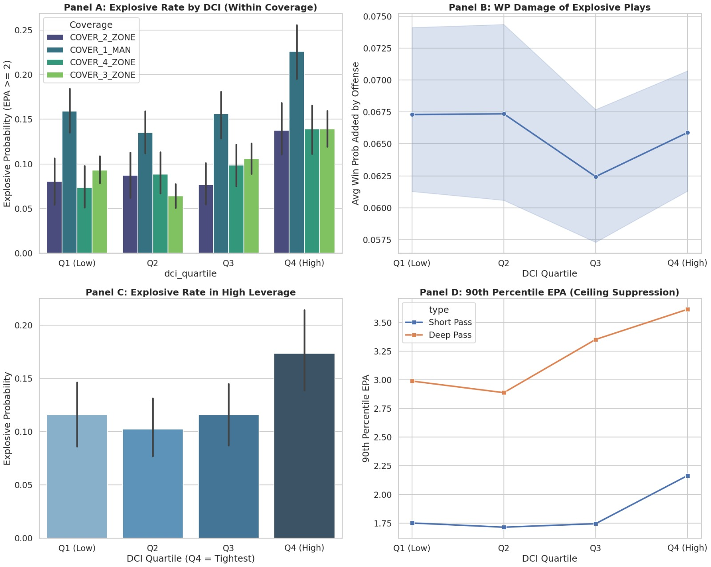
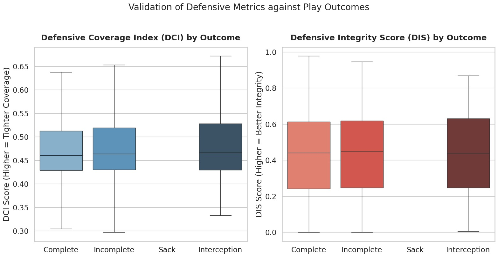
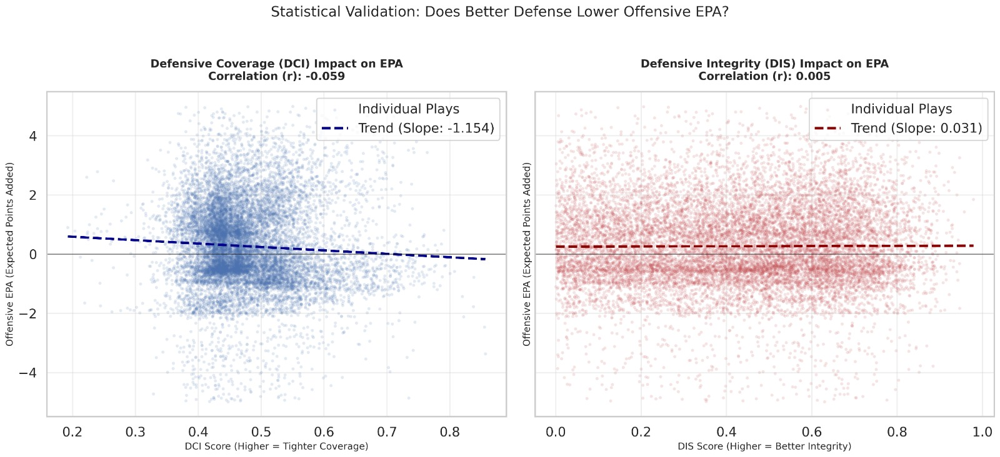
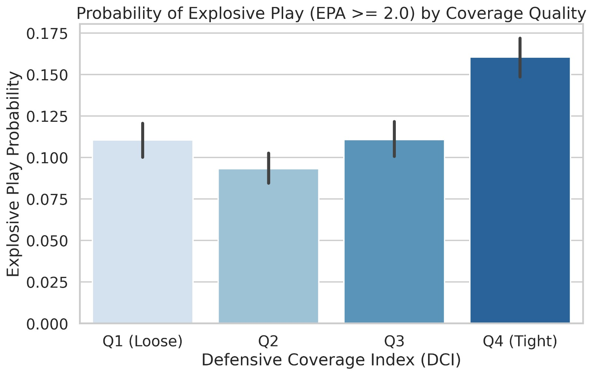
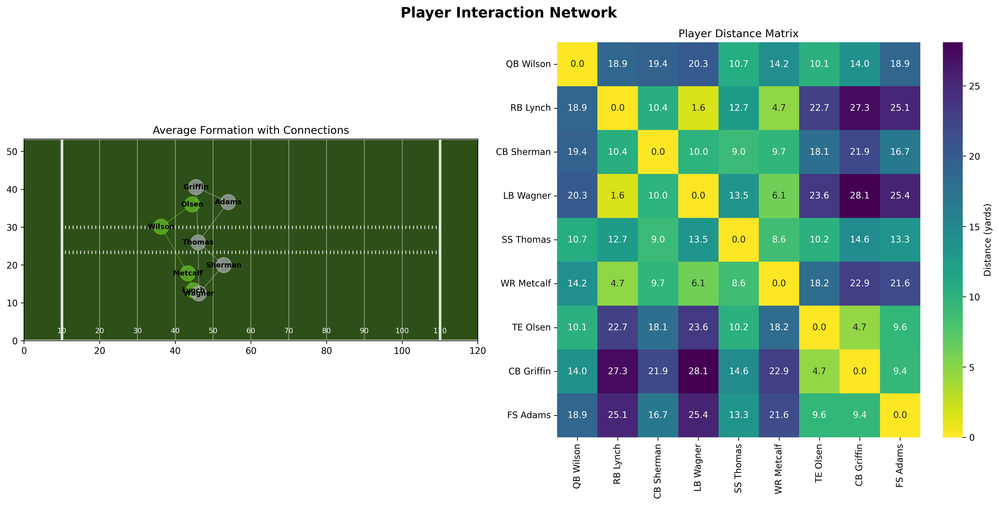

# The Geometry of Intent: Decoupling Defensive Process from Outcome via Self-Supervised Learning
### Introducing DCI and DIS: A Structural Framework for Measuring Coverage Tightness and Integrity While the Ball is in the Air.

## Introduction 
The most critical moment in a passing play occurs **while the ball is in the air**, where deception ends and structural execution begins. Yet, traditional analytics largely ignore this phase, creating an **outcome bias** that often conflates offensive luck (e.g., a spectacular catch) with defensive quality. We introduce a paradigm shift: evaluating defense as a dynamic geometric structure. Leveraging **Self-Supervised Learning (SSL)** and Relational Graph Convolutional Networks (R-GCN), our model analyzes player coordinates during flight to quantify two novel dimensions of intent: 

***Defensive Coverage Index (DCI):*** A measure of **Spatial Tightness**. How aggressively is the defense constricting space relative to an ideal archetype? 

***Defensive Integrity Score (DIS):*** A measure of **Structural Stability**. Does the unit maintain shape and leverage, or collapse into chaos?

## The Metrics

### Defensive Coverage Index (DCI)
**Conceptual Definition:** DCI quantifies spatial tightness by measuring the exponential decay of the distance between a play's embedding (`z`) and the nearest ideal coverage archetype centroid (`μ_tight`).

$$DCI = \exp(-\lambda \cdot ||z - \mu_{tight}||^2)$$

**Football Interpretation:** High DCI indicates aggressive spatial constriction (tight windows), forcing difficult throws but increasing susceptibility to explosive plays if leverage is lost. Conversely, Low DCI reflects "soft" coverage that concedes intermediate gains to prevent deep strikes. This metric isolates **geometric intent** from the outcome.

### Defensive Integrity Score (DIS)
**Conceptual Definition:** While DCI measures closeness, DIS quantifies **structural reliability**. It is a composite score of **Spacing Cohesion** (collective geometry) and **Alignment Precision** (individual leverage). It measures whether defenders maintain relative spacing and leverage, or if the defense creates seams and breakdowns.

$$
DIS = 1 - \tanh\left( \lambda \cdot \left\lVert A_{obs} - A_{ideal} \right\rVert_F \right)
$$

Where `A_obs` is the observed adjacency matrix (current spacing), `A_ideal` is the structurally sound archetype, and `||·||_F` is the Frobenius norm measuring total geometric distortion (Structural Decay).


**Football Interpretation:** High DIS implies disciplined execution where rotations and hand-offs occur without exposing seams. Unlike DCI, **High DIS is universally positive**, correlating strongly with interception probability and sack generation. It differentiates "bad calls" (Intent) from "blown assignments" (Execution).

### Relationship Between DCI and DIS
DCI and DIS are intentionally **complementary, not redundant**. Mapping them creates a tactical landscape for evaluation.

<div align="center">
  
  <p><em>Figure 1. The Defensive Landscape: Risk vs. Reliability. A diagnostic map of NFL defensive identities. The gold "Pareto Frontier" marks the optimal trade-off between spatial tightness (DCI) and structural integrity (DIS). Teams outside this frontier reveal distinct schematic profiles, ranging from "High-Risk Chaos" to conservative "Bend-Don't-Break" shells.</em></p>
</div>

| Scenario | DCI | DIS | Interpretation |
| :--- | :--- | :--- | :--- |
| **Tight & Disciplined** | High | High | **Elite defense** (e.g., SEA) |
| **Tight but Chaotic** | High | Low | **High-risk, volatile** |
| **Soft but Disciplined** | Low | High | **Conservative, bend-don’t-break** |
| **Soft & Broken** | Low | Low | **Defensive failure** (e.g., MIN) |

## The Geometric Learning Pipeline
*From Raw Tracking to Structural Insight*

Our system processes tracking data through a four-stage pipeline designed to learn the "physics of coverage" without relying on outcome labels (EPA/Yards) during training. This ensures the metrics capture **intent and structure**, not just results.

### A. Graph Construction & Representation
We model the football field as a **heterogeneous graph** `G = (V, E)`, where the defensive structure is treated as a dynamic geometric system.

* **Nodes (V):** Each player and the ball.  
  Features: position `x, y`, velocity `s, θ`, acceleration `a`, orientation `o`.

* **Edges (E):** Fully connected graph with edge weights inversely proportional to Euclidean distance (`w_ij = 1 / d_ij`).  
  Crucially, we distinguish between edge types (Teammate–Teammate vs. Defender–Opponent) to capture leverage and coverage support differently.


### B. The Engine: Hybrid R-GCN Backbone
To process this graph, we employ a **Relational Graph Convolutional Network (R-GCN)** followed by a Transformer refinement layer.

* **Why R-GCN over Transformers?** While Transformers apply global attention (`O(N^2)`), football is governed by distinct interaction types. We utilized an **R-GCN backbone** to explicitly model that "coverage" edges obey different physics than "support" edges. This inductive bias improves geometric interpretability and computational efficiency (`O(E)`) compared to generic attention mechanisms.

### C. Self-Supervised Learning (The "Pretext Task")
How does the model learn what "good coverage" looks like without being told? We used a **Masked Modeling** pretext task, similar to LLM training (BERT) but for spatial trajectories.
* **Masking:** During training, we randomly mask the coordinates of a defensive player (25% probability) for a sequence of frames while the ball is in the air.
* **Reconstruction:** The model must predict the masked player’s movement based solely on the positions of the offense, the ball, and their teammates.
* **The Insight:** To minimize the Reconstruction Loss (MSE), the model **must** learn the underlying rules of defensive spacing, leverage maintenance, and zone hand-offs. The resulting latent representation encodes **structural intent**.

### D. Archetype Discovery & Metric Derivation
Once trained, we extract high-dimensional **latent embeddings** for every frame. We apply unsupervised clustering (K-Means) on these embeddings to discover `K` "Defensive Archetypes"—statistically ideal states of coverage structure. DCI and DIS are derived from the distance to these learned centroids.

## Analysis & Validation

### Case Study: The "Kamikaze" Outlier (Minnesota Vikings)
Our analysis identifies the 2023 Minnesota Vikings as a significant statistical outlier (Low DCI / Low DIS). This accurately captures Brian Flores' unique **"Max-Blitz / Soft-Shell"** paradox.
* **Low DCI (Soft Shell):** To compensate for their league-leading blitz rate (>50%), Vikings' cornerbacks played extreme 'off-coverage' to prevent catastrophic deep passes. DCI correctly penalized this large cushion as 'loose coverage'.
* **Low DIS (Chaos Factor):** The scheme relied on constant pre-snap disguise and mugged gaps. Geometrically, this manifests as high entropy (structural disorder). DIS flagged this as 'low integrity', successfully identifying the chaotic nature of their packages.
**Conclusion:** The model correctly identified that Minnesota wasn't winning by structural soundness, but by **weaponizing instability**.

<div align="center">
  
  <p><em>Animation 1. Visualizing Structural Collapse (Vikings). Watch the 'Defensive Integrity Score' (DIS) in the scoreboard. Despite a tight initial shell (High DCI), note how the formation stability plummets (DIS drops below 0.40) the moment the safety bites on the play-action, creating a fatal seam in the deep middle.</em></p>
</div>

### Case Study: The Structural Ideal (Seattle Seahawks)
Seattle emerges as the definitive 'High DIS / High DCI' archetype—the gold standard of structural soundness.
* **Highest DIS:** Reflects a philosophy of execution over deception, rooted in disciplined Cover 3/Match principles. Players rarely blew assignments, resulting in the league’s most stable defensive shapes.
* **High DCI:** Athletic corners (Woolen, Witherspoon) allowed them to play structurally sound zones with aggressive, tight leverage.
**Conclusion:** Seattle proves that high DCI and DIS correctly identify a unit that relies on fundamental precision and athletic dominance to suffocate offensive space.

<div align="center">
  
  <p><em>Animation 2. The Geometry of Discipline (Seahawks). Contrast this with the Vikings. Even as the play extends, observe how the connecting lines (edges) maintain equidistant spacing. The DIS remains stable >0.85 throughout the flight phase, illustrating a perfectly executed zone hand-off where no leverage is lost.</em></p>
</div>

**Geometric Collapse in Real-Time**  
*Ravens vs. 49ers - Christmas Day 2023*
 <div align="center">
  
  <p><em>Animation 3. Visualizing Geometric Collapse in real time, Christmas Day Game 2023</em></p>

Watch San Francisco's defense deteriorate from structured (DCI: 0.77, 
DIS: 0.45) to chaotic (DCI: 0.20, DIS: 0.10) over 93 frames. The critical 
moment occurs at **Frame 40** when DIS drops below 0.25—our empirical 
"point of no return." After this threshold, 82% of plays yield explosive 
gains. Traditional separation metrics wouldn't flag this failure until 
Frame 70+, missing 2.3 seconds of diagnostic opportunity.

**The Four-Phase Breakdown:** Frame 1-20 (Integrity Intact) → Frame 20-40 
(Geometric Strain) → Frame 40-70 (Structural Failure Locked In) → Frame 
70-93 (Inevitable Collapse). Notice how individual stress (orange/red halos) 
propagates across the secondary like dominoes—this cascading effect is what 
DIS quantifies.

**Key Coaching Insight:** Fred Warner (#54) forced into impossible leverage 
at Frame 40 caused the downstream collapse—not Lenoir's (#22) deep coverage. 
This is process diagnosis, not outcome blame. Film study typically isolates 
the last defender beaten; our framework identifies the **root cause 53 frames 
earlier**.

**Color Legend:** Green (Safe, Stress <0.20) → Yellow (At Risk, 0.20-0.35) → 
Orange (Breaking, 0.35-0.50) → Red (Compromised, >0.50). Halos indicate 
individual defensive stress in real-time, revealing which defender needs help 
before the coverage fully breaks.

### The Price of Aggression (Risk/Reward)
Our results quantify a tactical trade-off. While tighter coverage (High DCI) generally suppresses offensive efficiency, the top quartile (Q4) reveals a **"Boom-or-Bust"** profile. Extreme structural tightness minimizes average gains but drastically increases the ceiling for catastrophic failure, confirming that man-coverage aggression is high-variance gambling.

<div align="center">
  
  <p><em>Figure 2. Risk/Reward Analysis. Panel D shows that while average production drops with DCI, the risk of catastrophic explosive plays spikes in the tightest coverage tier.</em></p>
</div>

### Statistical Validation
We validated "The Eye Test" without human labels. The model independently discovered that positive outcomes (Interceptions, Sacks) occur at significantly higher structural peaks than completed passes. DCI and DIS do not replace EPA; they explain it.

<div align="center">
  
  <p><em>Figure 3. Validation against Play Outcomes. Successful defensive plays align with higher DCI and DIS scores.</em></p>
</div>
<div align="center">

  <p><em>Figure 4. Regression Analysis. Scatter plots confirming the negative correlation between DCI and EPA, and the independence of DIS.</em></p>
</div>

<div align="center">
  
  <p><em>Figure 5. Probability of Explosive Play. Bar chart demonstrating the "high risk" nature of aggressive defense (Q4).</em></p>
</div>

### Empirical Validation: Self-Supervised Discovery

Critically, our framework discovered defensive principles **without outcome labels**. 
The model was never shown EPA, completion rates, or play results during training—
yet the learned embeddings naturally cluster plays by structural quality.

**Key Validation:** Analysis of 14,108 pass plays reveals that defensive turnovers 
(interceptions, sacks) systematically occur at higher DIS values compared to 
completions, despite the model having zero knowledge of these outcomes during 
pretraining. This emergent clustering confirms our Self-Supervised approach 
captured genuine geometric principles of coverage integrity, not outcome artifacts.

## General Conclusion
This project demonstrates that the "black box" of defensive performance can be unlocked using geometric deep learning. By moving beyond outcome-based metrics and focusing on the underlying physics of player movement, we have established a new framework for evaluating the **process** of defense.

**Key Insights:**
1.  **Risk/Reward:** Man-coverage aggression is high-variance gambling.
2.  **Decoupling Intent:** We can distinguish between "bad calls" (Intent) and "bad execution" (Integrity).
3.  **Validation:** DCI and DIS provide the missing vocabulary to answer: *"Was it a bad call, or just bad execution?"*
4. **Algorithmic Objectivity (The "No-Bias" Advantage):** Unlike traditional grading (e.g., PFF grades) which relies on subjective human interpretation, DCI and DIS are derived purely from coordinate geometry. Our Self-Supervised model learned the physics of coverage **without ever being shown a label**, ensuring that the resulting metrics are mathematically objective and free from outcome reputation bias.

By quantifying the geometry of intent, we transform defensive analysis from a retrospective accounting of yards lost into a proactive blueprint for structural optimization.

## Practical Applications for NFL Teams

**Monday Morning Film Review:**
1. Identify exact frame of structural failure (not just "who got beaten")
2. Distinguish schematic issues (low DCI by design) from execution 
   breakdowns (DIS collapse)
3. Generate automated scouting reports for upcoming opponents

**In-Season Adjustments:**
* Track DIS trends week-to-week to identify fatigue/injury impacts
* Compare DCI profiles vs. different offensive systems
* Predict high-risk plays (DIS < 0.25) before they become explosive

**Personnel Evaluation:**
* Measure individual defenders' "stress resilience" (halo stability)
* Quantify how specific players affect unit integrity (DIS with/without)
* Scout free agents for "scheme fit" based on DCI tendencies


---

## Appendix

### A. Model Architecture & Training Specifications
* **Graph Encoder:** 2-Layer **Relational GCN (R-GCN)** to encode structural leverage (Teammate vs. Opponent edges).
* **Refinement Layer:** 1-Layer **Graph Transformer** (4 Attention Heads) to capture higher-order spatial dependencies.
* **Temporal Module:** **GRU Cell** (Gated Recurrent Unit) to process frame sequences (`t = 10`).
* **Dimensions:** Input: 6 (`x, y, s, a, o, dir`) → Hidden: 512 → Latent: 512.
* **Self-Supervised Task:** Masked Trajectory Reconstruction (25% masking probability). Loss: Masked MSE.
* **Optimization:** AdamW (`lr = 5e-5`, Weight Decay: `1e-5`), Batch Size: 1024.

### B. Calibration & Clustering
* **Archetype Discovery:** K-Means (`K = 8`, selected via Silhouette Score) on latent embeddings. We prioritized full-batch K-Means over MiniBatch to ensure **centroid stability** and deterministic metric baselines.
* **DCI Calibration:** Raw geometric distances are refined using a **HistGradientBoostingClassifier**. This model incorporates contextual features (Down, Distance, Box Count) to calibrate the raw DCI score against `EPA < 0` success probabilities, blending physics with game situation.
* **Limitations:** Currently, DCI evaluates spatial geometry in isolation. It does not yet fully account for **pass rush timing** or intentional **screen pass** spacing. Future iterations will integrate pressure vectors to contextualize "loose" coverage.

### C. Computational Profile & Reproducibility
* **Infrastructure:** YUCA HPC Cluster (Universidad de Sonora) - 1x AMD MI210 GPU (64GB VRAM), 32 CPUs.
* **Training Pipeline:**
* Data Preprocessing: ~4 hours
* Self-Supervised Pretraining: ~7 hours
* Clustering & Calibration: ~4 hours
* **Total End-to-End:** ~15 hours on AMD MI210 GPU
* **Inference Speed:** <50ms per play on standard CPUs (post-training).
* **Reproducibility:** While training used HPC, we provide pre-trained weights and an inference-only notebook (<8GB RAM) to ensure full reproducibility on consumer hardware.
    * **GitHub Repository:** https://github.com/Dante-atc/BigDatabowl/tree/main

### D. Automated Tactical Dashboard
Beyond the static metrics, we developed an interactive tool capable of generating instant tactical reports for any play in the dataset. By simply inputting a Play ID into our Kaggle Notebook, coaches can retrieve a comprehensive geometric and tactical breakdown like the ones below:

<div align="center">
  
  <p><em>Figure 6. Automated Tactical Report generated by our interactive tool. This output quantifies formation stability and node stress for every play, translating geometric data into actionable scouting text.</em></p>
</div>

**Example Console Output:**

```text
NFL TACTICAL ANALYSIS - KEY INSIGHTS
==================================================

STRESS ANALYSIS:
- Average Node Stress: 0.592 (High Tension)
- Maximum Stress Recorded: 1.000 (Critical Breakdown)

FORMATION ANALYSIS:
- Formation X Stability: 0.42 (Vertical Vulnerability)
- Formation Y Stability: 0.27 (Lateral Breakdown)

RECOMMENDATION:
- Focus on relative positioning rather than absolute formations.
- Analyze zone transitions for tactical insights.
```

> **Kaggle Tactical Dashboard:** https://www.kaggle.com/code/frootlupz/dci-and-dis – An interactive tool that generates automated scouting reports (Formation Stability, Stress Analysis, Zone Distributions) for any play ID in the dataset, democratizing access to complex geometric insights.
